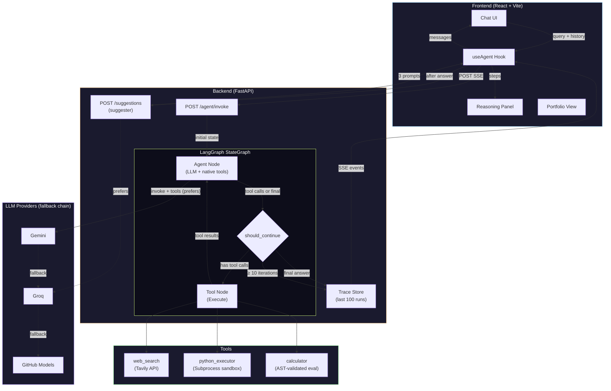

# ReAct Agent — Full-Stack

Full-stack ReAct agent: FastAPI + LangGraph backend with visible reasoning trace, React + Vite frontend with live SSE streaming, resizable sidebar panels, and a portfolio landing page. Free/freemium model providers only, zero OpenAI/Anthropic dependency.


## Architecture

```text
react-agent/
├── backend/              FastAPI app, LangGraph ReAct agent, tools, tests
│   ├── agent/
│   │   ├── graph.py      StateGraph: agent_node, tool_node, should_continue
│   │   ├── llms.py       FreeModelFallback chain + per-role provider preference, usage tracking
│   │   ├── tools.py      web_search, python_executor, calculator
│   │   ├── suggestions.py Conversation-aware prompt suggester (Groq-preferred, static fallback)
│   │   ├── prompts.py    SYSTEM_PROMPT for native tool calling
│   │   ├── redaction.py  Secret redaction for logs and error messages
│   │   └── state.py      AgentState TypedDict, MaxIterationsError
│   ├── api.py            FastAPI routes, SSE streaming, CORS, rate limiting, trace store
│   ├── main.py           Scripted ReAct demo runner (fake LLM, no API keys)
│   ├── evals/            Agent evaluation harness (task success + tool selection)
│   └── tests/            Unit tests (agent, API, LLMs, redaction)
├── frontend/             React 19, TypeScript, Vite, TailwindCSS
│   └── src/
│       ├── App.tsx           Shell: resizable left sidebar, tab navigation (Chat / About)
│       ├── hooks/useAgent.ts SSE client, session persistence (localStorage), mock fallback
│       ├── components/
│       │   ├── ChatWorkspace.tsx     Chat + reasoning trace layout
│       │   ├── demo/ChatPanel.tsx    Message list, static starter prompts, server-generated suggestions
│       │   ├── demo/ReasoningPanel.tsx  Trace timeline with Thought/Action/Observe steps
│       │   ├── demo/TraceDock.tsx    Telemetry strip, progress bar, run metadata
│       │   ├── ui/animated-ai-chat.tsx  Auto-resizing input with send/clear controls
│       │   ├── PortfolioView.tsx     Landing page shell (Hero + HowItWorks + Stack + Footer)
│       │   ├── HeroSection.tsx       Above-the-fold hero with animated agent flow preview
│       │   ├── HowItWorksSection.tsx Three-card explainer + flow pipeline strip
│       │   └── StackSection.tsx      Technology table + GitHub CTA card
│       └── types/index.ts  Step, StreamEvent, AgentResponse, AgentState, AgentConfig
├── api/index.py          Vercel Python Function entrypoint (imports backend/api.py)
├── scripts/dev-vercel.mjs  Full-stack local dev wrapper (builds frontend, runs Vercel or uvicorn)
└── vercel.json           Build config + SPA rewrite rules
```

### Backend flow

`agent_node` calls the LLM with the `SYSTEM_PROMPT` (which includes the current date and current-fact rules) and the tool schemas, using native function calling. If the model returns tool calls, the graph routes to the tool node; otherwise the content is the final answer. When the query requires current facts, it forces `web_search` before answering, even if the model tries to answer directly. A cap of 2 searches per run prevents search loops.

`tool_node` executes each tool call, appends a `ToolMessage` for the model, and creates a `Step` with `thought` (the model's text alongside the call), `action`, `action_input`, `observation`, and `timestamp`, then increments `iteration_count`.

`should_continue` is the graph router: it routes to `tool_node` when an `Action` exists, ends when a `Final Answer` exists, and raises `MaxIterationsError` at 10 iterations. Without this, a bad agent becomes a while loop with self-esteem.

### Frontend flow

The `useAgent` hook POSTs to `/api/run` with `stream: true`, parses SSE progressively (`parseSseEvents` + `sseDataFromEvent`), and converts each payload into a `Step` on the timeline. The session (messages + steps + runSummary) persists in `localStorage`. If `VITE_AGENT_MOCK=true`, it runs a mock sequence without an API. Connection state (`checking`, `online`, `mock`, `error`) is loaded via `/api/config`. After a run completes, it fetches `/api/suggestions` with the conversation and renders the returned follow-up prompts.

The interface has two tabs: **Chat** (conversation workspace with reasoning panel) and **About** (portfolio landing with hero, how it works, stack). The left sidebar is drag-resizable. The reasoning panel (right side on desktop) or bottom sheet (mobile) shows each step with a colored badge (Thought / Action / Observe / Final), timestamp, cycle, and tool/input/elapsed metadata.

## Diagram



## Tools

| Tool | Description | API |
| --- | --- | --- |
| `web_search` | Web search via Tavily returning compact results with title, URL, and truncated snippet. Defaults: `TAVILY_MAX_RESULTS=2`, `TAVILY_SNIPPET_CHARS=360`. | Tavily API (`TAVILY_API_KEY`) |
| `python_executor` | Runs code in an isolated subprocess with AST validation, import whitelist (`math`, `json`, `re`, `statistics`, `random`, `itertools`, `functools`, `sympy`, `numpy`), blocked builtins (`open`, `exec`, `eval`, `compile`, `__import__`, etc.), and a 10s timeout. Automatically strips Markdown fences and redundant safe imports. | Local subprocess sandbox |
| `calculator` | Evaluates math expressions with `eval()` and no builtins, AST validation of every node, and full access to the `math` module. Only arithmetic operators, constants, and `math.*` functions are allowed. | Local `math` module |

## Model Providers

The agent does not use OpenAI or Anthropic. The default chain uses only providers configured in `.env`, in this fallback order:

1. `GEMINI_API_KEY` with `GEMINI_MODEL`, default `gemini-2.5-flash`
2. `GROQ_API_KEY` with `GROQ_MODEL`, default `llama-3.3-70b-versatile`
3. `GITHUB_MODELS_TOKEN` + `GITHUB_MODELS_MODEL`

All three are reached through one OpenAI-compatible tool-calling path (Gemini via its OpenAI-compat endpoint), so the agent uses native function calling, not text parsing. `FreeModelFallback` tries each provider in order. If one fails, it skips to the next. If all fail, it raises `RuntimeError` with concatenated errors (secrets redacted).

### Per-role provider preference

Two roles each prefer a different provider while still falling back across the whole chain, via `providers_preferring(name)`:

- **Responder** (the agent's answers) prefers **Gemini** — more accurate on knowledge questions. Override with `RESPONDER_PROVIDER`.
- **Suggester** (the prompt suggestions, below) prefers **Groq** — fast, with a generous free tier, so the frequent suggestion calls do not compete with the responder for Gemini's tighter quota. Override with `SUGGESTER_PROVIDER`.

The preference only reorders the front of the chain. If the preferred provider is missing or fails, the role degrades to the next available one, so a single-key setup still works. `/config` reports the responder's active model, which the frontend shows in the chat status bar.

These providers may have their own quotas, terms, and limits. For absolute zero cost, run a local model and adapt `agent/llms.py`; a free cloud API is still a cloud API, not a contractual miracle.

## Prompt suggestions

After each answer, the frontend POSTs the recent conversation to `/suggestions`. The suggester (`agent/suggestions.py`) makes one Groq-preferred LLM call that, given the conversation plus the agent's live tool list, returns up to three short follow-up prompts as JSON. It is tool-agnostic — the tool list is passed in at call time, not hardcoded with per-tool rules — so it generalizes to any toolset. The call is non-blocking (the answer renders first), exempt from the rate limit, and degrades to a small generic static list on any failure, empty conversation, or unparseable model output. The empty-chat screen keeps a fixed set of starter prompts, since there is no conversation to analyze yet.

## Frontend

| Component | Responsibility |
| --- | --- |
| `App.tsx` | Shell: resizable left sidebar, desktop/mobile toggle, Chat/About tabs, shell state persistence in localStorage |
| `ChatWorkspace` | Two-column layout: chat + reasoning panel. Header with status, active model, and available tools |
| `ChatPanel` | Message list, empty state with static starter prompts, server-generated post-response suggestions, auto-scroll |
| `ReasoningPanel` | Animated timeline (Framer Motion) of steps with color-coded badges by type, cycle, timestamp, tool metadata. Telemetry strip with steps/tools/time. Progress bar. Desktop: resizable right sidebar. Mobile: Radix Dialog bottom sheet |
| `AnimatedAIChat` | Auto-resize textarea, Enter to submit, clear history, loading state |
| `PortfolioView` | Landing page: HeroSection (title + CTA + animated agent flow preview), HowItWorksSection (3 cards + pipeline strip), StackSection (stack table + GitHub card), PageFooter |
| `useAgent` | Core hook: fetch config, SSE streaming, post-answer suggestions fetch, session persistence, mock fallback, state machine (checking → online/mock/error) |

## API Endpoints

| Endpoint | Method | Description |
| --- | --- | --- |
| `/agent/invoke` | POST | Run agent (JSON or SSE with `stream:true`). Accepts `query`, `stream`, `history[]`. |
| `/run` | POST | Backward-compatible alias for `/agent/invoke` |
| `/run` | GET | Streaming via query param `?query=...&stream=true` |
| `/health` | GET | Status + list of available tools |
| `/config` | GET | Active model (the responder's preferred provider), fallbacks, tools. Used by the frontend on boot |
| `/suggestions` | POST | Conversation-aware follow-up prompts. Accepts `history[]`, `tools_used[]`; returns `suggestions[]`. Rate-limit exempt |
| `/trace/{run_id}` | GET | Returns the stored `AgentResponse` for a previous run lookup |

All endpoints are duplicated with an `/api/` prefix for Vercel routing compatibility.

Streaming emits SSE payloads in this shape:

```json
{"type":"thought|action|observation|final","content":"...","step":1,"timestamp":"...","status":"running","tool":"web_search","action_input":"...","run_id":"abc123","elapsed_ms":142}
```

## Quick Start

### Backend

```bash
cd backend
python -m venv .venv && source .venv/bin/activate  # Linux/macOS
# .venv\Scripts\Activate.ps1  # Windows PowerShell
pip install -r requirements.txt
cp .env.example .env  # fill in your keys
python -m uvicorn api:app --reload --port 8000
```

`python main.py` is not the server — it runs scripted ReAct examples with a fake LLM (no API keys required), useful for inspecting the graph flow.

### Frontend

```bash
cd frontend
npm install
npm run dev
```

### Full-stack (Vercel local)

```bash
npm run dev:vercel
```

The wrapper `scripts/dev-vercel.mjs` builds `frontend/dist`, clears `VIRTUAL_ENV` so Vercel detects the correct venv, binds to `127.0.0.1:3000`, and falls back to `uvicorn api.index:app` if `@vercel/python` fails to start on Windows/Git Bash.

## Deploy

```bash
vercel
```

Vercel builds the frontend via `cd frontend && npm install && npm run build`, serves static assets from `frontend/dist`, and routes everything to `api/index.py` which imports the FastAPI app from the backend.

## Validate

```bash
# Backend tests
cd backend && python -m unittest discover -s tests -v

# Frontend lint + build
cd frontend && npm run lint && npm run build
```

## Problem

LLM agents usually fail in the boring places: invisible reasoning, unbounded loops, mixed tool side effects, and APIs that return only the final answer. That is cute in a demo and radioactive in anything operational. On the frontend side, most agent demos either dump raw JSON or show a loading spinner until everything is done. Neither tells the user anything useful while the agent is still working.

## Solution

This project wraps a ReAct loop in LangGraph, exposes it through FastAPI with both sync and SSE modes, and stores the last 100 runs in memory for trace lookup. The React frontend consumes the SSE stream progressively, rendering each Thought, Action, and Observation step in a colored timeline as it arrives. The chat answer and the reasoning trace that produced it are always visible side by side.

`/agent/invoke` is the portfolio-facing endpoint, `/run` remains as a backward-compatible alias, `/health` lists available tools, `/config` gives the frontend everything it needs to render model status, and `/trace/{run_id}` returns the stored `AgentResponse`.

## Why This Solves It

**Backend:** LangGraph makes control flow explicit: reason, route, execute tool, observe, repeat, stop. Each tool call becomes a `Step`, so debugging is not archaeology. SSE exposes progress while the run is happening, which matters when a user needs to see whether the agent is thinking, acting, or stuck writing fanfic about acting.

**Frontend:** The split-pane layout (chat + reasoning trace) eliminates the "black box" problem. The timeline is not an afterthought panel — it is the core differentiation. Framer Motion animations, step badges, telemetry counters, and resizable panels make the reasoning visible and inspectable without requiring the user to open DevTools.

**Observability:** Every run reports token usage, estimated cost, latency, and the provider that served each call, surfaced on the API response and in the reasoning-trace header. An evaluation harness (`backend/evals/`) scores task success and tool-selection accuracy against a labelled dataset.

**Security:** `python_executor` runs in a subprocess with AST validation, import whitelist, blocked builtins, and a 10s timeout. `redaction.py` scrubs secrets from all log output and error messages. Rate limiting via slowapi caps at 10 req/min/IP. Memory content stored in Supabase via `memory_write` is **not auto-redacted** — the global secret redaction covers logs and error messages, not stored memory values. Per-session memory is capped at `MEMORY_MAX_STORED` entries (default 20) to bound Supabase free-tier storage growth.

## Metrics

| Metric | Value |
| --- | --- |
| Max ReAct iterations | `10` |
| Stored traces | Last `100` runs |
| Rate limit | `10 req/min/IP` |
| Tool calling | Native function calling (OpenAI-compatible) |
| Web search context | `2` results, `360` chars per snippet by default |
| Web search cap per run | `2` (prevents search loops) |
| Tools available | `3` (`web_search`, `python_executor`, `calculator`) |
| API modes | Sync JSON + SSE streaming |
| Chat history sent | Last `8` messages |
| Session persistence | localStorage (messages + steps + runSummary) |
| Frontend tabs | Chat, About (portfolio) |
| Test coverage | Unit tests for tools, graph flow, health, run, stream, trace, LLMs, redaction; agent eval harness |

## Key Decisions

**Why LangGraph over AgentExecutor:** LangGraph gives explicit nodes, router logic, state transitions, and a hard iteration boundary. `AgentExecutor` is convenient, but the control flow is more implicit. Implicit agent control flow is how debugging becomes interpretive dance.

**Why SSE over WebSockets:** The agent already produces sequential events: thought, action, observation, final. SSE maps to that shape without WebSocket ceremony. One request, ordered events, easy `curl -N`, done. The frontend parses SSE chunks progressively with a manual buffer, not EventSource, to handle Vercel edge proxying and partial flushes.

**Why subprocess for python_executor:** `exec()` in-process is a sandbox escape waiting to happen. A subprocess with AST validation, import whitelisting, and a 10s timeout is defense in depth. The subprocess pre-loads sympy and numpy (when available) so the agent does not waste a step importing them.

**Why FreeModelFallback:** Portfolio projects should not cost money to run. The fallback chain means if Gemini's free tier rate-limits, Groq picks up. If Groq is down, GitHub Models gets a shot. The user never sees a failed run unless every provider is genuinely unreachable.

**How MaxIterationsError works:** `should_continue` checks `iteration_count` before routing back into tools. At `10`, it raises `MaxIterationsError` instead of letting the loop continue. This makes runaway reasoning fail loudly instead of charging rent in your process.

**Why redaction exists:** API keys leak through error messages more often than through `.env` files. `redaction.py` scrubs all configured secret values from log output and exception strings, including query parameters and Bearer tokens. The log record factory is monkey-patched at startup so every log line is automatically redacted.

## Environment

Copy `backend/.env.example` to `backend/.env` and configure:

```env
# At least one LLM provider required
GEMINI_API_KEY=
GROQ_API_KEY=
GITHUB_MODELS_TOKEN=
GITHUB_MODELS_MODEL=

# Optional per-role provider preference (defaults shown; each still falls back)
RESPONDER_PROVIDER=gemini   # provider the agent prefers for answers
SUGGESTER_PROVIDER=groq     # provider the suggester prefers for prompt suggestions

# Web search (optional but recommended)
TAVILY_API_KEY=
```

Frontend env (optional):

```env
VITE_API_URL=http://localhost:8000   # default: /api
VITE_AGENT_MOCK=true                 # run without backend
```
